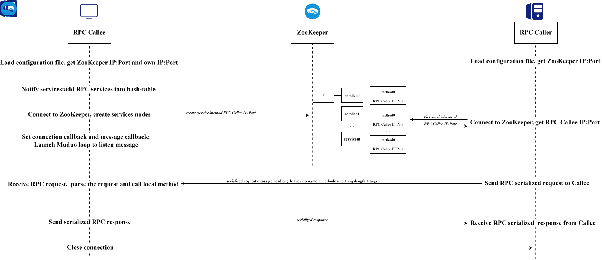

         ___  ___   _____   ______  _____    _____   _____  
        /   |/   | |  _  \ |___  / |  _  \  |  _  \ /  ___| 
       / /|   /| | | |_| |    / /  | |_| |  | |_| | | |     
      / / |__/ | | |  ___/   / /   |  _  /  |  ___/ | |     
     / /       | | | |      / /__  | | \ \  | |     | |___  
    /_/        |_| |_|     /_____| |_|  \_\ |_|     \_____| 

MPZRPC: A Muduo&Protobuf&ZooKeeper-based RPC framework.

# 📑 Overview
MPZRPC is a RPC framework based-on [Muduo](https://github.com/chenshuo/muduo.git), [Google-Protobuf](https://github.com/protocolbuffers/protobuf.git) and [ZooKeeper](https://github.com/apache/zookeeper.git). It employs Muduo as network communication component, employs Protobuf as serialization and deserialization component of RPC request and response, employs ZooKeeper as middleware to store information of RPC provider, aka. callee. 

# 🛠️ Environment configuration & Build
As mentioned above, this project is based-on Muduo, Protobuf and ZooKeeper, you can follow these tutorials below to configure your basic environment.
- [how to use Muduo in your project?](https://github.com/chenshuo/muduo-tutorial.git)
- [how to use Protobuf in your project?](https://github.com/protocolbuffers/protobuf.git)
- [how to use ZooKeeper in your project?](https://github.com/apache/zookeeper.git)

Then, clone MPZRPC with `git clone https://github.com/Knight-kkk/MPZRPC.git`.

Grant execution permission to automatic building shell script `autobuild.sh` with `chmod 777 autobuild.sh` and run `./autobuild.sh`.

If you see these message above, congratulations, the building process is done successfully.
```
[ 50%] Built target mprpc
[ 66%] Built target consumer
[ 83%] Built target provider
[100%] Built target zkClient
```

# 💻 Usage
 Run zookeeper with `/path/to/zookeeper/zkServer.sh start`.
 
 Run RPC provider with `/path/to/MPZRPC/bin/provider -c test.conf`.
 
 Run RPC consumer with `/path/to/MPZRPC/bin/consumer -c test.conf`.

# 🔨 DIY
The `test.conf` above in Section [Usage](#Usage) stores the IP and port information of RPC provider server and ZooKeeper server, its content is as below:
```
# You would better not modify the field names otherwise you will need to modify the corresponding code in ../src/
ProviderIP = 127.0.0.1
ProviderPort = 6666
ZooKeeperIP = 127.0.0.1
# 2181 is the default running port of ZooKeeper
ZooKeeperPort = 2181
```
If you run the provider or(and) ZooKeeper in other IP or(and) Port, you should modify the filed above.

Moreover, if you wanna publish your own RPC services, you should create a `.proto` file, define the data strcuture of arguments and return values of RPC method(s) and the method(s), and compile the `.proto` file with `protoc [.proto filename] --cpp_out=[path/to/targetfile]`.

After compling, you will see a `.pb.h` and a `.pb.cpp` file, you should implement the vitual method you defined.

Dut to the reason that MPZRPC is a framework project, the exact business code is not concerned, so I just provided 3 simple echo methods to valid the effectiveness of MPZRPC. If you are not familiar with the usage of Protobuf, you can learn it in [how to use Protobuf in C++?](https://protobuf.dev/getting-started/cpptutorial/).

# 🎨 Features
- MPZRPC employs Muduo as network communication component, which enables the RPC server(s) to support high concurrency.
- MPZRPC employs Protobuf as message serilization&deserialization component, which demonstrates higher efficiency compared to other serialization and deserialization components such as JSON and XML.
- MPZRPC employs middleware ZooKeeper as store the IP and port of available services, which enables more flexible service discovery and updates, additionally ensuring service availability.

# 📂 Project organization
- `bin`: excutable target program.
- `build`: build files.
- `examples`: examples to demonstrate the usage of Protobuf and ZooKeeper.
- `lib`: target library file and head files of MPZRPC.
- `log`: log files
- `src`: source code and head files
- `test`: test demo files

# 🔀 Workflow


